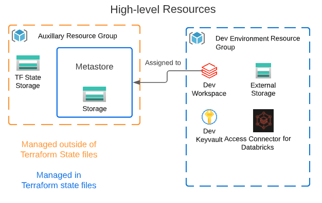

## Introduction 

This repo is a quick start for setting up a new Databricks workspace, accompanying storage account, keyvault, and managed identity via an access connector.  It also configures a new metastore for your Azure region of choice and provides examples of creating workspace administration resources such as additional user(s), assigning a user to a workspace group, clusters, etc.

## Getting Started
___
### Prerequisites
1. Tools\CLI
    * Terraform ( [Install Terraform CLI](https://developer.hashicorp.com/terraform/tutorials/aws-get-started/install-cli) )
    * Az CLI ( [install Azure CLI](https://learn.microsoft.com/en-us/cli/azure/install-azure-cli) )
2. Azure RM Permissions
    * Suscription Contributor to create resource group.  
    * Resource Group Contributor for creating resources
3. Databricks 
    * Account Administrator - for creating Metastore and associating workspace to the newly created metastore
    * This repo also leverages the fact that SCIM provisioning is setup for Azure AD and Databricks by using an AAD token to authenticate to the created workspace.  An alternative could be to create a Databricks PAT via the workspace UI and passing that in
4. Powershell
    * This repo uses powershell as an example of orchestrating the different Terraform configuration.  It is by no means required if you'd rather use a different method. YMMV

High-level resources created

### Filling out .conf and .tfvars files

Where appropriate there are provided examples of configuration and variable files required for use by terraform.  Backend .conf files describe a resource group, storage account, container, and file name ( key ).  Currently there is a prerequisite required to have the storage account and container created.  This is where your tf state file(s) will live.  Fill those out and the tfvar examples and you're ready to run the provided powershell script provision-dev.ps1 or another orchestration script you've written

### SCIM Provisioning
https://docs.databricks.com/administration-guide/users-groups/scim/aad.html

Best practices: https://learn.microsoft.com/en-us/azure/databricks/administration-guide/users-groups/best-practices
